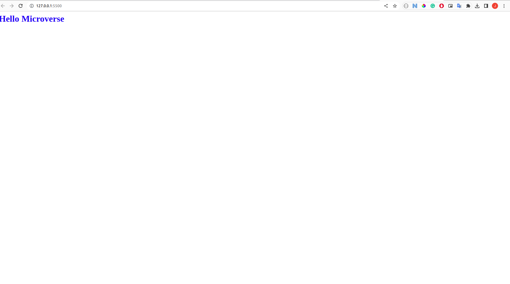

# Hello Microverse

> This project is a basic starter project for Microverse. This project mainly showcases my skills with GitHub Flow and Git.

### Hello Microverse Screenshot:



# Getting Started

To get a local copy of the repository please run the following commands in your terminal:

```
$ cd <folder>
```

```
$ git clone git@github.com:jacobrees/Hello-Microverse.git
```

To launch an instance of this app. Simply open the index.html file in your browser.

## Built With

- HTML
- CSS

## Authors

👤 **Jacob Rees**

- Github: [@jacobrees](https://github.com/jacobrees)
- Linkedin: [jacob-rees-a6507b1a6](https://www.linkedin.com/in/jacob-rees-a6507b1a6/)

## 🤝 Contributing

Contributions, issues and feature requests are welcome!

## Show your support

Give a ⭐️ if you like this project!

## Acknowledgments

- Code linters used within this project have been supplied by Microverse

## 📝 License <a name="license"></a>

This project is [MIT](./license.md) licensed.
